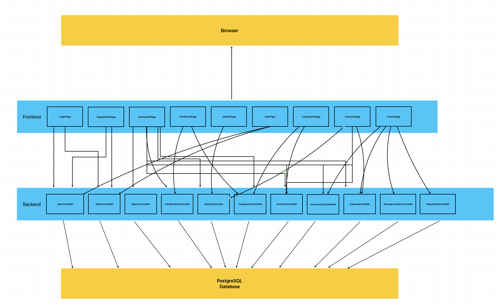
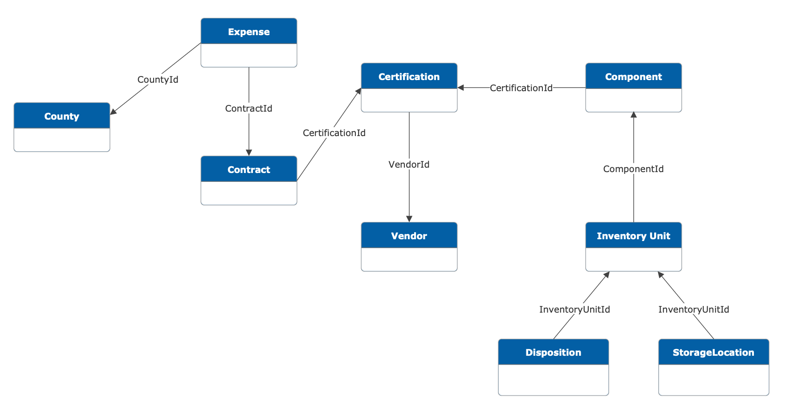

# Architecture

# Explanation
## Database
- PostgreSQL Database
  - This database is what we use in the project to store user data, entries for each type of item. It qualifies as a module since the database stores the necessary data for the backend to send to the frontend, and it can be replaced with any other type of database. We selected PostgreSQL based on the client's recommendation.

## PHP Laravel Backend
- UseController
  - This is use for authentication/authorization. This is a module because it is the part of the project that keep the site secure through login system and determine permission that the user have.
- AdminController
  - This is module because it's use for managing users. Things like approve user after registration, delete user, or even help user reset password. 
- ReportController
  - ReportController is what grabs the data the requested into a report. This is a module because each report is composed with different entity, the report controller should be the only controller that handle getting those entities ready into a report
- CertificationController
  - CertificationController is what sends and receives data about certification contents for the site. It is a module because it is the part of the project that takes and handles data regarding certifications details on the site.
- VendorController
  - VendorController is what sends & receives data about certification contents for the site. It is a module because it is the part of the project that takes and handles Vendor information on the site.
- ComponentController
  - Each certification has the possibility of multiple components included this controller will be handling & receive data regarding components, it's module for that reason.
- ContractController
  - ContractController is what sends and receives data about contract that the county has with vendor for the site. It is a module because it is the part of the project that takes and handles data regarding contract on the site; no other controller should handle contract.
- InventoryUnitController
  - InventoryUnitController is what sends and receives data about inventory units that the county has under with in the components. It is a module because it is the part of the project that takes and handles data regarding inventory units on the site; no other controller should handle inventory units.
- ExpenseController
  - ExpenseController is what sends and receives data about expenses that the county has with vendor, the contract will also have expenses. It is a module because it is the part of the project that takes and handles data regarding expenses on the site; no other controller should handle inventory expenses.
- StorageLocationController
  - StorageLocationController is what keep on tracks the location each unit is kept at. It is a module because it's the part of the project that handles data regarding location of the unit. No other controller should.
- DispositionController
  - DispositionController is what keep on tracks what unit is disposed. It is a module because it's the part of the project that handles data regarding disposition of the unit. No other controller should.

## React Frontend
- LoginPage
  - Login page uses userController & adminController to send and receive data regarding login information for each type of user. It is a module because no other part of the frontend will handle logging in.
- RegisterPage
  - RegisterPage uses userController and adminController to send and receive data regarding the creation of Users and Admins. It is a module because it is the only part of the frontend that will handle registering new users of either type.
- DashboardPage 
  - This uses reportController,certificationController, vendorController, componentController and InventoryUnitController, to get data from those respective entity in order to display it for user. It is a module because it contains all the user-facing aspects of dashboard information
- CertificationPage
  - This uses certificationController & componentController to get information & edit certificates and its respective component to display for user. It is a module because it contains all the user-facing aspects of certification
- VendorPage
  - This uses vendorController Controller to get information & edit certificates and its respective component to display for user. It is a module because it contains all the user-facing aspects of certification
- UserPage
  - UserPage will manage user data and permissions using AdminController for user management (approval, deletion, etc.) and UserController for authentication. The ComponentPage will handle certification components through ComponentController. It is a module because it is the sole component handling user management, preventing overlap with other areas of the frontend
- ComponentPage
  - The ComponentPage will handle certification components through ComponentController. It is a module because it manages certification components via ComponentController
- ContractPage
  - The ContractPage will manage county-vendor contracts using ContractController, while the CountyPage will display county-specific data, integrating VendorController, CertificationController, expenseController, and InventoryUnitController.
- CountyPage
  - This page uses ContractController, ExpenseController, Inventory Unit

## Browser
- Website will be locally hosted, no need for hosting layer. Browser will directly render the frontend.