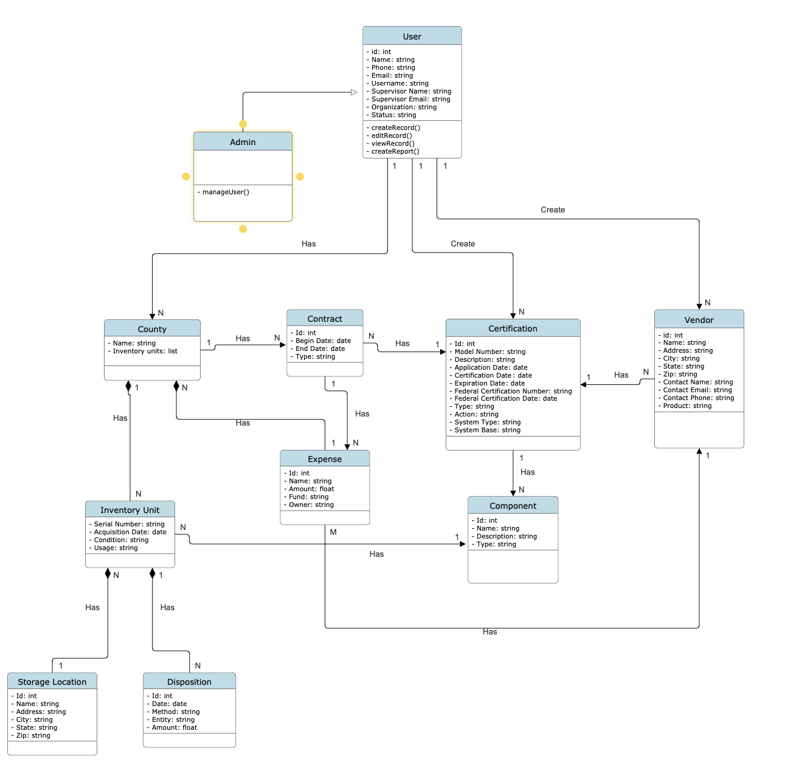

# Domain Model

## Domain Model Explanation
- User
  - User is an abstract class that is the super class for Admin because Admin shares all properties. User also has access to edit parts of the database through CRUD function calls. 
- Admin
  - Admin inherits the User class and also has the ability to manage other users.
- Database Entities
  - County
    - Refers to a State County by its unique name
  - Contract
    - Refers to a Contract handled by a county
  - Certification
    - Refers to a Certification created by a user
  - Vendor
    - Refers to a vendor that handles an expense
  - Inventory Unit
    - Refers to an Inventory Unit of a Component
  - Expense
    - Refers to financial Expenses of each County
  - Component
    - refers to a Component of a Certification which has multiple Inventory Units
  - Storage Location
    - Refers to the physical location of the Inventory Unit
  - Disposition
    - Refers to a Disposition of an Inventory Unit
