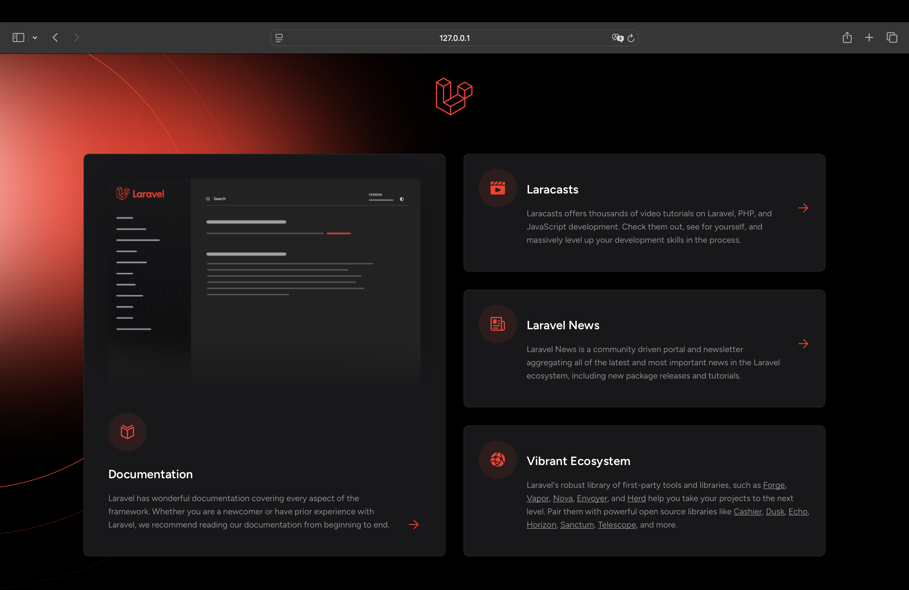
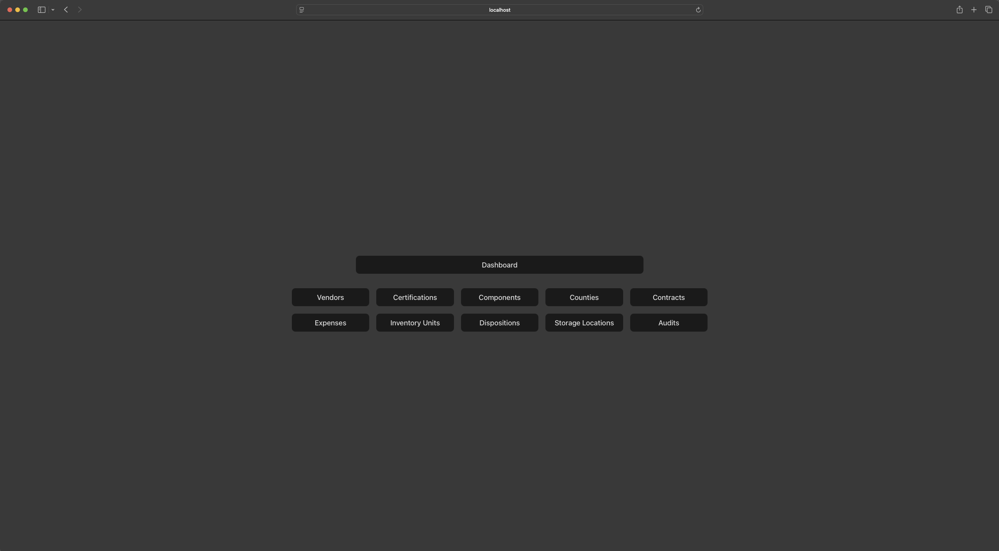
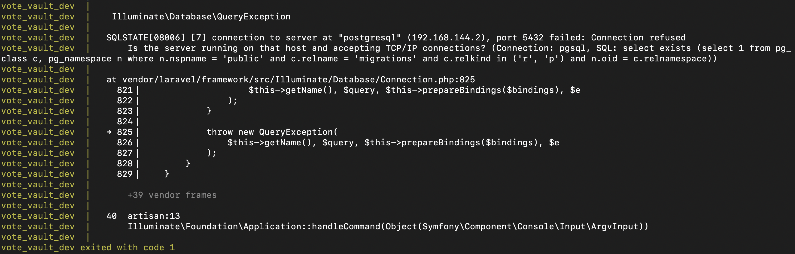
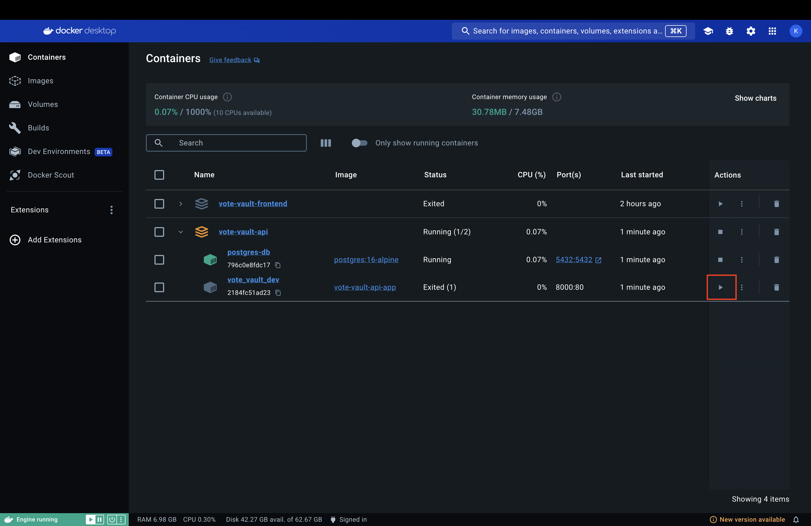
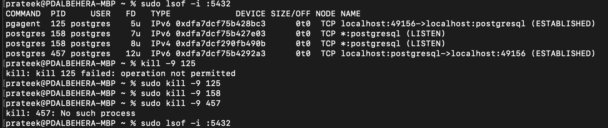

# Deployment
## Overview
This document provides step-by-step instructions to deploy, maintain, and troubleshoot the project. It is designed for users with a semi-technical background.

# Server Requirements

## Hardware
- **CPU**: Minimum 2 cores
- **RAM**: 4GB minimum
- **Disk Space**: At least 10GB of free space for application and dependencies

## Software
- **Operating System**: Linux-based server (Ubuntu 20.04 or newer recommended)
- **Docker**: Installed for containerized deployment
- **Docker Compose**: Version 3 or higher

## Setup
### Clone the frontend using:
```
git clone https://github.com/KyuXCode/vote-vault-frontend
```
1. Make sure you're in the ```vote-vault-api``` directory
    ```
    cd vote-vault-api
    ```
2. Start the docker container for the api
    ```
    docker compose up --build
    ```
3. Go to your browser and enter this link: [http://127.0.0.1:8000/](http://127.0.0.1:8000/), you should see a default Laravel page 


### Clone the api into a different directory with:
```
git clone https://github.com/KyuXCode/vote-vault-api
```
Make sure you're in the ```vote-vault-frontend``` directory
```
cd vote-vault-api
```
Start the docker container for the api.
```
docker compose up --build
```
Go to your browser and enter this link: [http://127.0.0.1:3000/](http://127.0.0.1:3000/), you should see the React frontend. 

## Common Errors
### Error 1: Connection to server at "postgresql" failed: connection refused
- Sometimes ```vote_vault_dev``` image finish before ```postgres-db``` image which will throw the error like below when you ran ```docker compose up --build``` in ```vote-vault-api``` folder. 
- **Solution 1:** Go to docker decktop and find your ```vote-vault-api``` container and start the ```vote_vault_dev``` image again by clicking the highlighted play button 
- **Solution 2:** sometime your local port at ```5432``` is taken so the container couldn't use the port to connect to the PostgreSQL database, run the following command (or equivalent on window) to check if the port is currently in use
- In your terminal, do this to see if it's in used
  ```
  sudo lsof -i :5432
  ```
  
- Kill all the processes that are running under this port
  ```
  sudo kill -9 <pid>
  ```
- Run the command again to verify no process is running now
  ```
  sudo lsof -i :5432
  ```