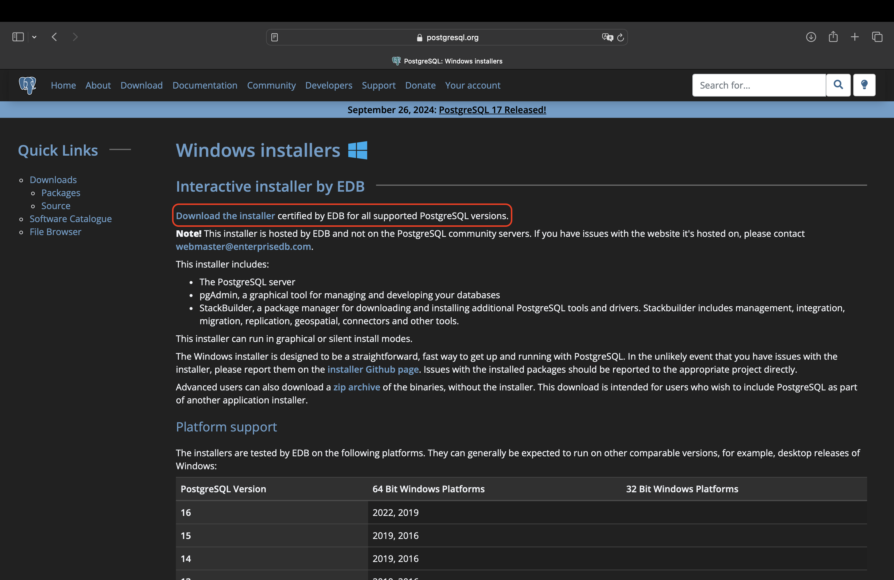
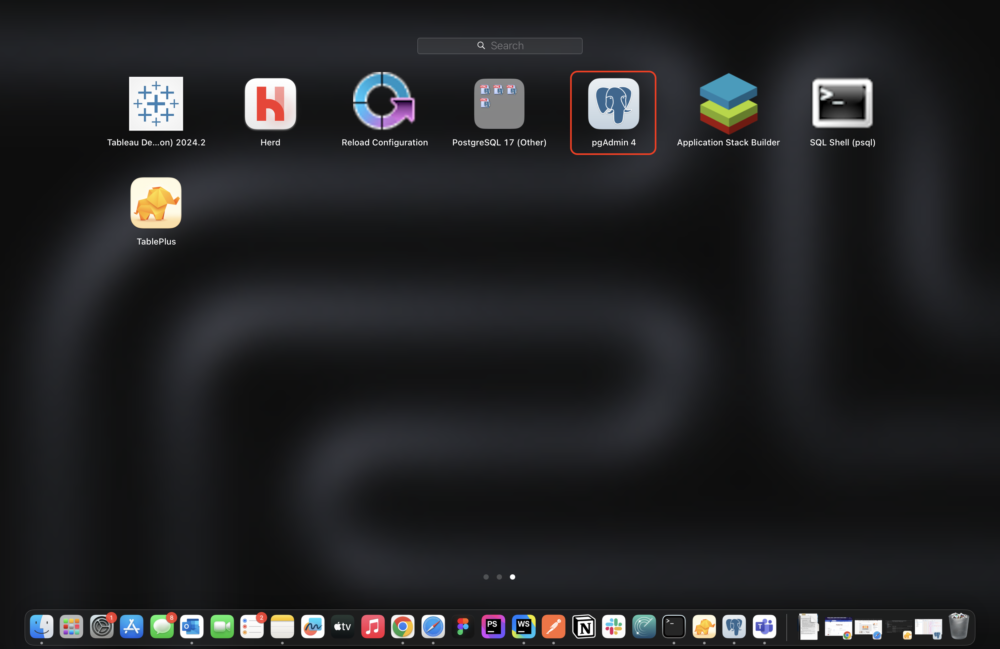
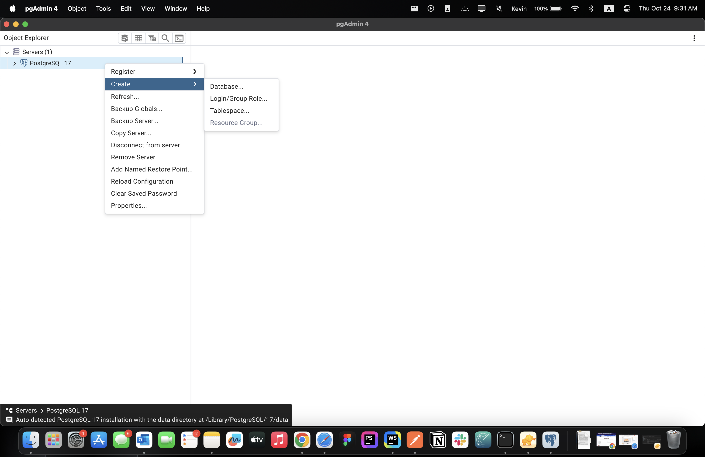
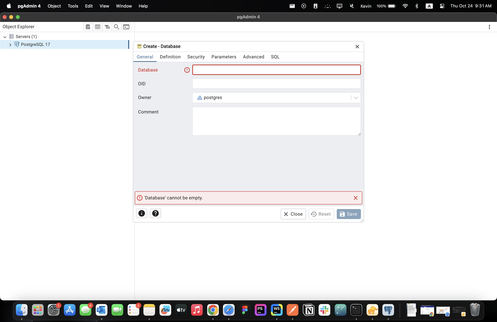

# Vote Vault API

This project used php with Laravel 11, see below instructions to replicate a local enviroment for testing


## Install Prerequisites

### Install PostgreSQL
- We used PostgreSQL 16 at the time of the project
- Visit this [link](https://www.postgresql.org/download/) to install PostgreSQL
- Select the OS you're on and make sure you install the EDB installer too
  - Here's what it located on the installation page for Window (See the red highlight area): 

### Install php & Composer
- We used php 8.3.12 & Composer 2.7.7 at the time of the project 
- If you don't have PHP and Composer installed on your local machine, the following commands will install PHP, Composer, and the Laravel installer on macOS, Windows, or Linux:

#### For macOS: 
```
/bin/bash -c "$(curl -fsSL https://php.new/install/mac)"
```

#### For Windows Powershell:
```
Set-ExecutionPolicy Bypass -Scope Process -Force; [System.Net.ServicePointManager]::SecurityProtocol = [System.Net.ServicePointManager]::SecurityProtocol -bor 3072; iex ((New-Object System.Net.WebClient).DownloadString('https://php.new/install/windows'))
```

#### For Linux:
```
/bin/bash -c "$(curl -fsSL https://php.new/install/linux)"
```

After running one of the commands above, you should restart your terminal session. To update PHP, Composer, and the Laravel installer after installing them via php.new, you can re-run the command in your terminal.
If you already have PHP and Composer installed, you may install the Laravel installer via Composer:
```
composer global require laravel/installer
```

## Setup Local Environment
1. Open pgAdmin4 that were installed by the EDB installation 
2. Right-click on your PostgreSQL tab & select create, then select Database 
3. Enter ```vote_vault_api``` in the Database field & click save 
4. Clone this repository -> [Vault Vote API](https://github.com/KyuXCode/vote-vault-api) in any directory you want
    ```
    git clone https://github.com/KyuXCode/vote-vault-api.git
    ```
5. Create ```.env``` file in the project directory if not already
6. Find ```.env.example``` in the project directory
7. Find copy the content over to your ```.env``` file
8. Find this section in ```.env``` file
    ```
    DB_CONNECTION=pgsql
    DB_HOST=127.0.0.1
    DB_PORT=5432
    DB_DATABASE=vote_vault_api
    DB_USERNAME=
    DB_PASSWORD=
    ```
9. Make sure ```DB_HOST``` ```DB_PORT``` ```DB_USERNAME``` ```DB_PASSWORD``` all match with your setting in pgAdmin 4

## Start Using the API
1. Open the repository you cloned in previous step in any IDE you preferred, I'm using phpStorm but Visual Studio Code works too
2. Open the terminal once you make sure you're in the project directory enter the following to start the api, this should run the migration and start it locally
    ```
    php artisan migrate
    php artisan serve
    ```
3. Your terminal should display the local address for the api. Open the address in a browser 
4. The following are the routes available for making CRUD calls
    ```
    /api/vendors
    /api/vendors/{id}
    /api/certifications
    /api/certifications/{id}
    /api/components
    /api/components/{id}
    /api/county
    /api/county/{id}
    ```
   