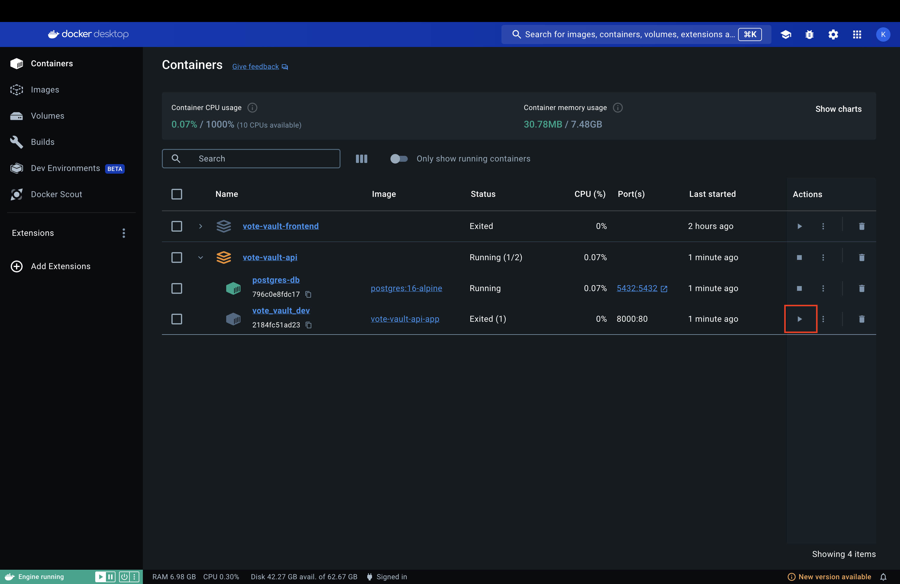

# Vote Vault

This project used php with Laravel 11 & PostgreSQL 16, see below instructions to replicate a local environment for testing.

## Install Prerequisites

### Install Docker Desktop
- Install Docker Desktop on your machine from this [documentation](https://docs.docker.com/get-started/get-docker/) or the link below.
  - [Mac](https://docs.docker.com/desktop/install/mac-install/)
  - [Windows](https://docs.docker.com/desktop/install/windows-install/)
  - [Linux](https://docs.docker.com/desktop/install/linux/)

### Setup Directory
- Make sure you're under **VoteVault** folder
- Clone the following repositories in that folder
  - https://github.com/KyuXCode/vote-vault-frontend
  - https://github.com/KyuXCode/vote-vault-api
- You can do it via command line:
  - Right-click on the VoteVault folder and select **New Terminal at Folder** or **Shift+Right-click** to an empty place on that folder to open a command line for Windows. 
  - Run these commands (it assumes you have git installed and git command accessible in PATH environment variable): 
   ```
   git clone https://github.com/KyuXCode/vote-vault-api.git
   git clone https://github.com/KyuXCode/vote-vault-frontend.git
   ```
  - Your folder should be something like this with ```vote-vault-api``` & ```vote-vault-frontend``` in your ```VoteVault``` folder. 
- Open the Docker Desktop app before the next stage 

## Start the Project Locally
### 1. Make sure you start the ```vote-vault-api``` first.
Make sure you're in the ```vote-vault-api``` directory 
```
cd vote-vault-api
```
Start the docker container for the api
```
docker compose up --build
```
Go to your browser and enter this link: [http://127.0.0.1:8000/](http://127.0.0.1:8000/), you should see a default Laravel page 

### 2. Then start ```vote-vault-frontend```
Make sure you're in the ```vote-vault-frontend``` directory
```
cd ..
cd vote-vault-api
```
Start the docker container for the api.
```
docker compose up --build
```
Go to your browser and enter this link: [http://127.0.0.1:3000/](http://127.0.0.1:3000/), you should see the React frontend. 


## Common Errors
### Error 1: Connection to server at "postgresql" failed: connection refused 
- Sometimes ```vote_vault_dev``` image finish before ```postgres-db``` image which will throw the error like below when you ran ```docker compose up --build``` in ```vote-vault-api``` folder. 
- **Solution 1:** Go to docker decktop and find your ```vote-vault-api``` container and start the ```vote_vault_dev``` image again by clicking the highlighted play button 
- **Solution 2:** sometime your local port at ```5432``` is taken so the container couldn't use the port to connect to the PostgreSQL database, run the following command (or equivalent on window) to check if the port is currently in use
- In your terminal, do this to see if it's in used
  ```
  sudo lsof -i :5432
  ```
  
- Kill all the processes that are running under this port
  ```
  sudo kill -9 <pid>
  ```
- Run the command again to verify no process is running now
  ```
  sudo lsof -i :5432
  ```