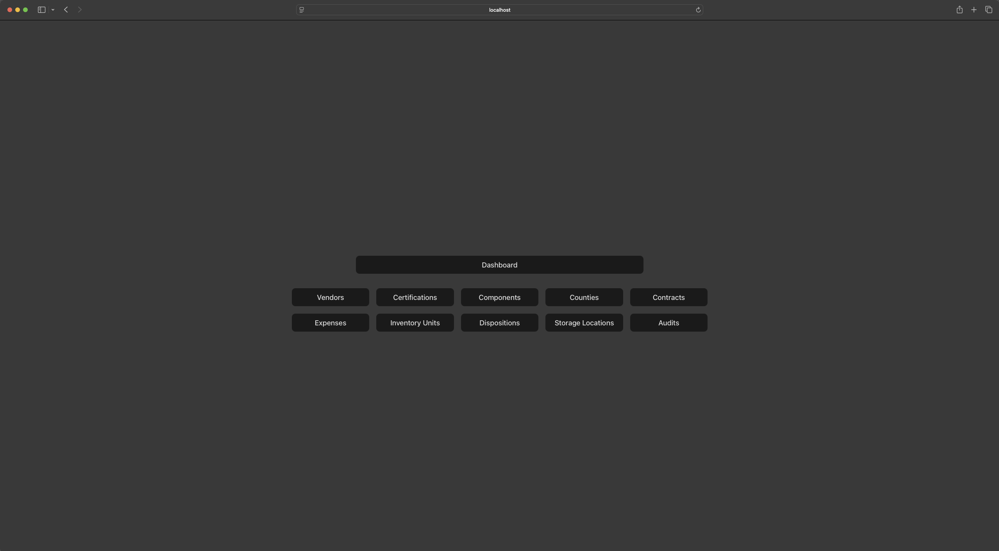

# Register
1. Visit ```/register``` to register 
2. If anything is wrong or missing you will see a section up top regarding what field was missing.
3. Once you register wait until management approve it from pending to active profile

# Log in
1. You will be redirected to a login page if you have not log in or if your login credential expired 
2. If you don't remember you password but in need to use the tool. You can log in by clicking Sign in with link and input the email you use for the account 
3. You will receive an email with an URL that will expire with in 30 minutes.


# How to Use Vote Vault
1. You should see something like this when you accessed the home page. 
2. Select dashboard to see an overview for some basic stats. 
3. Select audit to see 2 types of audit you can generate 
4. Once you select one type of audit you should be able to see it as data or choose to download it as a csv with the seed number as file name 
5. We're going to use Vendor to demonstrate how to create and edit a record
6. Select vendor in the home page 
7. Select ```Create Vendor``` 
8. Filled out the form data 
9. Select ```Create Vendor``` when all the field required is filled. 
10. You should see the data you just created at the bottom of the list 
11. Select ```Edit``` on the data you want to edit 
12. The form should show up with existing data filled 
13. After you made changes to field(s) click ```Update vendor```, you should see your data with the updated field 